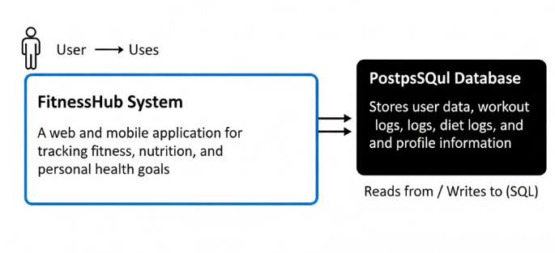

# **FitnessHub**

FitnessHub is a comprehensive, full-stack personal wellness planner. It provides a secure, robust, and scalable backend API for a modern, single-page frontend application. It moves beyond simple static logs by providing a dynamic and secure backend, allowing authenticated users to manage and track their fitness journey in granular detail.

The "why" of this project is to provide a single, reliable platform for users to manage their fitness journey. It connects user authentication with deep, relational data, tracking not just that a user worked out, but the specific sets, reps, and weight for every exercise. It also provides a detailed, date-based diet planner to log meals and track caloric intake against a user-defined goal.

The backend is built with Django and Django REST Framework, containerized with Docker, and connected to a PostgreSQL database. The frontend is a modern, responsive static HTML/JavaScript file that provides a dynamic, app-like experience without requiring a complex JavaScript framework.

# Installation

This project is designed to be run with Docker and Docker Compose.

## 1. Clone the repository

`git clone https://github.com/engrawaiszafar/FitnessHub.git`

`cd FitnessHub`

## 2. Build and start the containers in the background
This will build the 'app' image and start 'app' and 'db' services.

`docker-compose up --build -d`

## 3. Run database migrations
This applies the database schema (models) to the PostgreSQL container.

_`docker-compose exec app python manage.py migrate`_

## 4. (Optional) Create a superuser to access the Django admin
This admin panel is at _http://127.0.0.1:8000/admin/_

`docker-compose exec app python manage.py createsuperuser`

# Running the Application

The project is split into two parts: 

* the backend API

* the frontend HTML file.

### 1. Running the Backend API

To run the backend, simply use Docker Compose:

#### Start all services (if they are not already running)
`docker-compose up`

The API will be running at http://127.0.0.1:8000/api/

### 2. Running the Frontend Application

The frontend is a single, self-contained HTML file (e.g., Weekly Workout Planner.html). This file is not served by the backend.

To run the app, simply open the .html file directly in your web browser (e.g., by double-clicking it).

The JavaScript in the file is already configured to connect to your local API at http://127.0.0.1:8000. You can create an account, log in, and use all the features of the application.

# FitnessHub: User Stories
This document defines the functional and security requirements for the FitnessHub application.

## User Stories
### Authentication

***1. As a new user, I want to create a secure account so I can save my personal fitness data.***
#### Acceptance Criteria:

- Given I am on the auth page, I can toggle to the "Sign Up" form.

- When I submit a unique username and a password of at least 5 characters, my account is created.

- And I am automatically logged in and redirected to my personal dashboard.

***2. As a returning user, I want to log in to my account so I can access my saved plans and dashboard.***

#### Acceptance Criteria:

- Given I am on the auth page, I can use the "Login" form.

- When I submit my correct username and password, I receive an authentication token.

- And I am redirected to my personal dashboard and see a "Welcome" message.

**3. As an authenticated user, I want to log out so I can securely end my session**.

#### Acceptance Criteria:

- Given I am logged in, I can see a "Logout" button.

- When I click "Logout," my local authentication token is deleted, and the page reloads.

- And I am now logged out and see the "Login" and "Sign Up" buttons.

### Workout Logging (Workout Planner)
***1. As a registered user, I want to create a personal library of exercises so I can quickly find and log them later.***

#### Acceptance Criteria:

- Given I am on the "Workout Planner" page, I can see an "Add New Exercise" button.

- When I submit an exercise name and muscle group, the new exercise appears in my "Your Exercises" list.

***2. As a registered user, I want to log my specific sets, reps, and weight for an exercise on a specific date so I can track my strength progress over time.***

#### Acceptance Criteria:

- Given I am on the "Workout Planner" page, I can select a date using the date picker.

- When I click an exercise in my library, a form appears to log reps and weight.

- When I submit the set, it appears in "Today's Log" for the selected date.

- When I change the date, the "Today's Log" view updates to show only sets from that date.

### Diet Logging
***As a registered user, I want to log the food and calories for each meal so I can track my daily caloric intake.***

#### Acceptance Criteria:

- Given I am on the "Diet Planner" page, I can select a date.

- When I click "+ Add Food" for a meal (e.g., "Breakfast"), I am prompted for a food name and calories.

- When I add a food, it appears in the correct meal list, and the "Meal Total" and "Total Calories" counters update.

- When I change the date, the meal lists update to show data for that date.

***As a registered user, I want to set a daily calorie target so I can track my intake against a specific goal.***

#### Acceptance Criteria:

- Given I am on the "Diet Planner" page, I can see an input field for my "Calorie Target".

- When I enter a number and click "Save Target," my goal is saved to my profile.

- This target is loaded from my profile when I revisit the page.

### Dashboard
***As a registered user, I want to see a summary of my day's workout and diet on the home page so I can get a quick overview of my progress.***

#### Acceptance Criteria:

- Given I am logged in, navigating to "Home" redirects me to my personal dashboard.

- The dashboard shows a summary of sets logged for today (e.g., "bench: 4 sets logged").

- The dashboard shows my total calories consumed for today.

- (Future) The dashboard displays my calorie intake as an animated bar relative to my calorie target.

- The dashboard has buttons that link directly to the full "Workout Planner" and "Diet Planner" pages.

## Mis-user Stories

***As a malicious user, I want to guess API endpoint IDs to see another user's private workout and diet logs so I can steal their personal health information.***

#### Mitigation Criteria:

- All data-related API endpoints (e.g., /sets/, /dietlogs/, /exercises/) must be protected and require a valid authentication token.

- All API views must filter database queries by the authenticated user (request.user). A user must never be able to retrieve, update, or delete data that does not belong to them, even if they guess the correct object ID.

***As a malicious user, I want to submit a malicious script into an exercise name or food name field so I can trigger a Cross-Site Scripting (XSS) attack when my (or another user's) browser renders that data.***

#### Mitigation Criteria:

* The Django backend's ORM automatically parameterizes queries, preventing SQL Injection.

* The frontend application must never use .innerHTML to render user-provided text. All user-supplied data (exercise names, food names, etc.) must be rendered using .textContent or .innerText to ensure the browser treats it as plain text, not as executable code.

_**As a malicious user, I want to run a script to rapidly guess a user's password so I can brute-force my way into their account.**_

#### Mitigation Criteria:

* The API server must implement rate-limiting on the /api/token/ (login) endpoint to block IPs that make numerous failed attempts in a short period.

* The password length must be enforced in the serializer (min_length=5) to increase the difficulty of guessing.

**_As a user, I want to enter "ten" instead of "10" for my reps so I can potentially break the application or save invalid data._**

#### Mitigation Criteria:

* The frontend JavaScript performs a validation check (parseInt, parseFloat) before submitting data to the API and shows an alert if the data is invalid.

* The backend API serializers (IntegerField, DecimalField) will reject any non-numeric data with a 400 Bad Request response, ensuring data integrity in the database.

# C4 Model

## C1: System Context Diagram

## C2: Container Diagram

## C3: Component Diagram

# License

The MIT License (MIT)

Copyright (c) 2025 [Muhammad Awais Zafar]

Permission is hereby granted, free of charge, to any person obtaining a copy of this software and associated documentation files (the "Software"), to deal in the Software without restriction, including without limitation the rights to use, copy, modify, merge, publish, distribute, sublicense, and/or sell copies of the Software, and to permit persons to whom the Software is furnished to do so, subject to the following conditions:

The above copyright notice and this permission notice shall be included in all copies or substantial portions of the Software.

THE SOFTWARE IS PROVIDED "AS IS", WITHOUT WARRANTY OF ANY KIND, EXPRESS OR IMPLIED, INCLUDING BUT NOT LIMITED TO THE WARRANTIES OF MERCHANTABILITY, FITNESS FOR A PARTICULAR PURPOSE AND NONINFRINGEMENT. IN NO EVENT SHALL THE AUTHORS OR COPYRIGHT HOLDERS BE LIABLE FOR ANY CLAIM, DAMAGES OR OTHER LIABILITY, WHETHER IN AN ACTION OF CONTRACT, TORT OR OTHERWISE, ARISING FROM, OUT OF OR IN CONNECTION WITH THE SOFTWARE OR THE USE OR OTHER DEALINGS IN THE SOFTWARE.