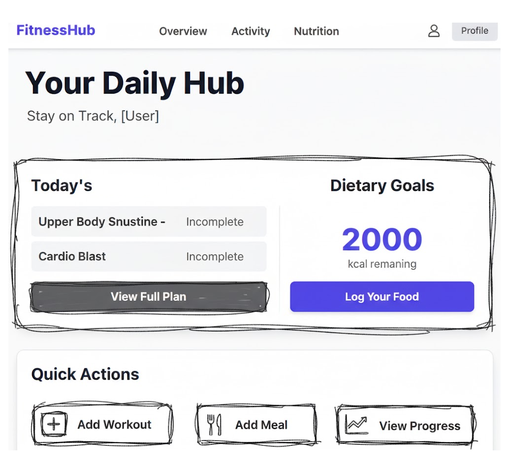
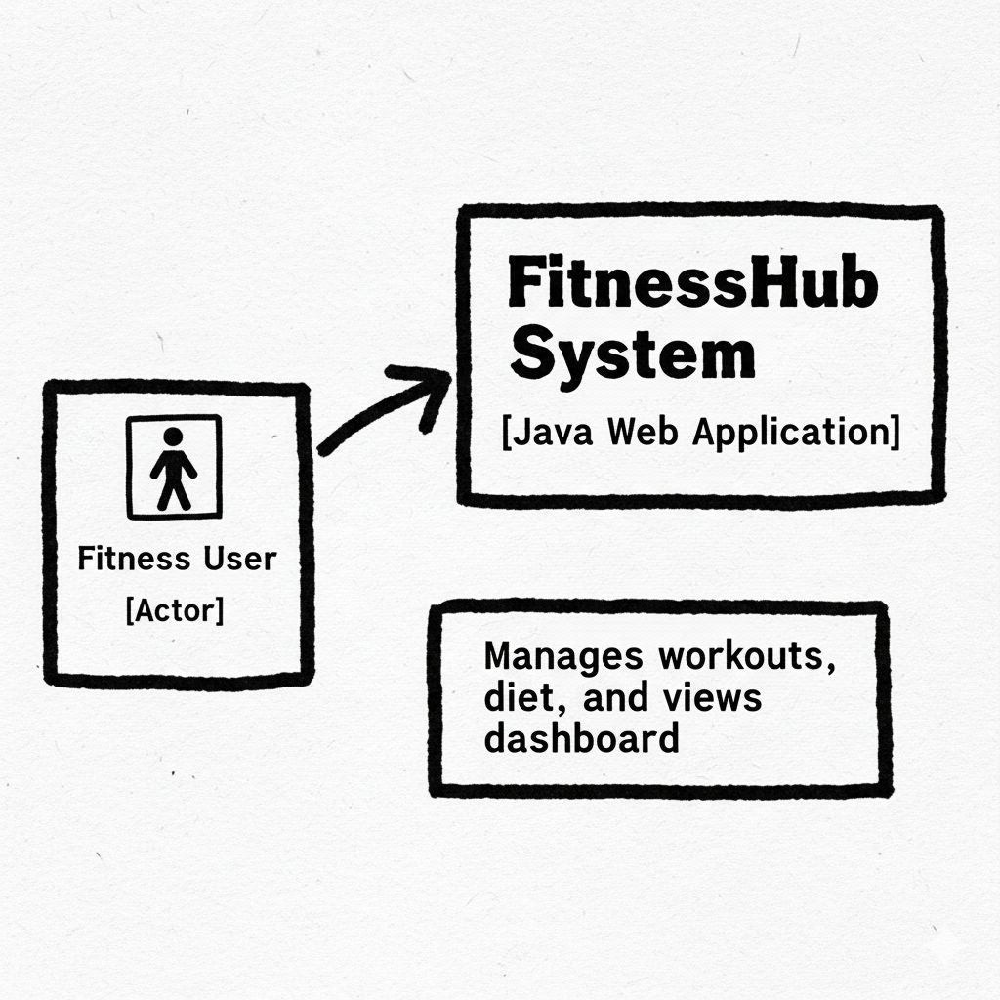
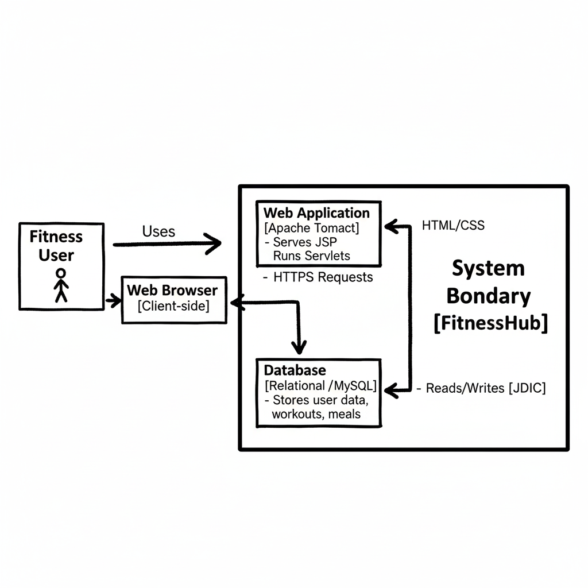
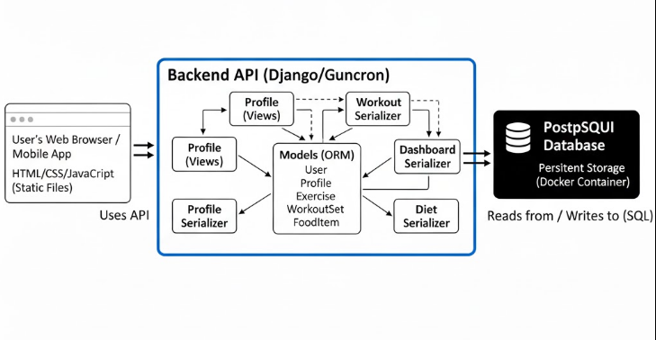

# FitnessHub: User Stories
This document defines the functional and security requirements for the FitnessHub application.

## User Stories
### Authentication

#### US-1.1 ####
As a **new user**, I want to **create a secure account** so I can **save my personal fitness data**.
#### Acceptance Criteria:

- Given I am on the auth page, I can toggle to the "Sign Up" form.

- When I submit a unique username and a password of at least 5 characters, my account is created.

- And I am automatically logged in and redirected to my personal dashboard.

#### US-1.2 ####
As a **returning user**, I want to **log in to my account** so I can **access my saved plans and dashboard**.

#### Acceptance Criteria:

- Given I am on the auth page, I can use the "Login" form.

- When I submit my correct username and password, I receive an authentication token.

- And I am redirected to my personal dashboard and see a "Welcome" message.

#### US-1.3 ####
As an **authenticated user**, I want to **log out** so I can **securely end my session**.

#### Acceptance Criteria:

- Given I am logged in, I can see a "Logout" button.

- When I click "Logout," my local authentication token is deleted, and the page reloads.

- And I am now logged out and see the "Login" and "Sign Up" buttons.

### Workout Logging (Workout Planner)

#### US-2.1 ####
As a **registered user**, I want to **create a personal library of exercises** so I can **quickly find and log them later**.

#### Acceptance Criteria:

- Given I am on the "Workout Planner" page, I can see an "Add New Exercise" button.

- When I submit an exercise name and muscle group, the new exercise appears in my "Your Exercises" list.

#### US-2.2 ####
As a registered user, I want to log my specific sets, reps, and weight for an exercise on a specific date so I can track my strength progress over time.

#### Acceptance Criteria:

- Given I am on the "Workout Planner" page, I can select a date using the date picker.

- When I click an exercise in my library, a form appears to log reps and weight.

- When I submit the set, it appears in "Today's Log" for the selected date.

- When I change the date, the "Today's Log" view updates to show only sets from that date.

### Diet Logging

#### US-3.1 ####
As a **registered user**, I want to **log the food and calories for each meal** so I can **track my daily caloric intake**.

#### Acceptance Criteria:

- Given I am on the "Diet Planner" page, I can select a date.

- When I click "+ Add Food" for a meal (e.g., "Breakfast"), I am prompted for a food name and calories.

- When I add a food, it appears in the correct meal list, and the "Meal Total" and "Total Calories" counters update.

- When I change the date, the meal lists update to show data for that date.

#### US-3.2 ####
As a **registered user**, I want to **set a daily calorie target** so I can **track my intake against a specific goal**.

#### Acceptance Criteria:

- Given I am on the "Diet Planner" page, I can see an input field for my "Calorie Target".

- When I enter a number and click "Save Target," my goal is saved to my profile.

- This target is loaded from my profile when I revisit the page.

### Dashboard

#### US-4.1 ####
As a **registered user**, I want to **see a summary of my day's workout and diet on the home page** so I can **get a quick overview of my progress**.

#### Acceptance Criteria:

- Given I am logged in, navigating to "Home" redirects me to my personal dashboard.

- The dashboard shows a summary of sets logged for today (e.g., "bench: 4 sets logged").

- The dashboard shows my total calories consumed for today.

- (Future) The dashboard displays my calorie intake as an animated bar relative to my calorie target.

- The dashboard has buttons that link directly to the full "Workout Planner" and "Diet Planner" pages.

## Mis-user Stories

#### MUS-1.1 ####

As a **malicious user**, I want to **guess API endpoint IDs to see another user's private workout and diet logs** so I can **steal their personal health information**.

#### Mitigation Criteria:

- All data-related API endpoints (e.g., /sets/, /dietlogs/, /exercises/) must be protected and require a valid authentication token.

- All API views must filter database queries by the authenticated user (request.user). A user must never be able to retrieve, update, or delete data that does not belong to them, even if they guess the correct object ID.

#### MUS-1.2 ####
As a **malicious user**, I want to **submit a malicious script into an exercise name or food name field** so I can **trigger a Cross-Site Scripting (XSS) attack when my (or another user's) browser renders that data**.
#### Mitigation Criteria:

* Content Security Policy (CSP): The application implements a strict Content Security Policy HTTP header that prevents the browser from executing unauthorized inline scripts or loading scripts from untrusted sources.

* Output Escaping: The frontend application must never use .innerHTML to render user-provided text. All user-supplied data (exercise names, food names, etc.) must be rendered using .textContent or .innerText to ensure the browser treats it as plain text, not as executable code.

#### MUS-1.3 ####
As a **malicious user**, I want to **run a script to rapidly guess a user's password** so I can **brute-force my way into their account**.

#### Mitigation Criteria:

* The API server must implement rate-limiting on the /api/token/ (login) endpoint to block IPs that make numerous failed attempts in a short period.

* The password length must be enforced in the serializer (min_length=5) to increase the difficulty of guessing.

#### MUS-1.4 ####
As a **user**, I want to **enter "ten" instead of "10" for my reps** so I can **potentially break the application or save invalid data**.

#### Mitigation Criteria:

* The frontend JavaScript performs a validation check (parseInt, parseFloat) before submitting data to the API and shows an alert if the data is invalid.

* The backend API serializers (IntegerField, DecimalField) will reject any non-numeric data with a 400 Bad Request response, ensuring data integrity in the database.

## Mockups

### 1. Landing Page

### 2. Activity Log Page

### 3. Food Log Page

## C4 Model

## C1: System Context Diagram

## C2: Container Diagram

## C3: Component Diagram

